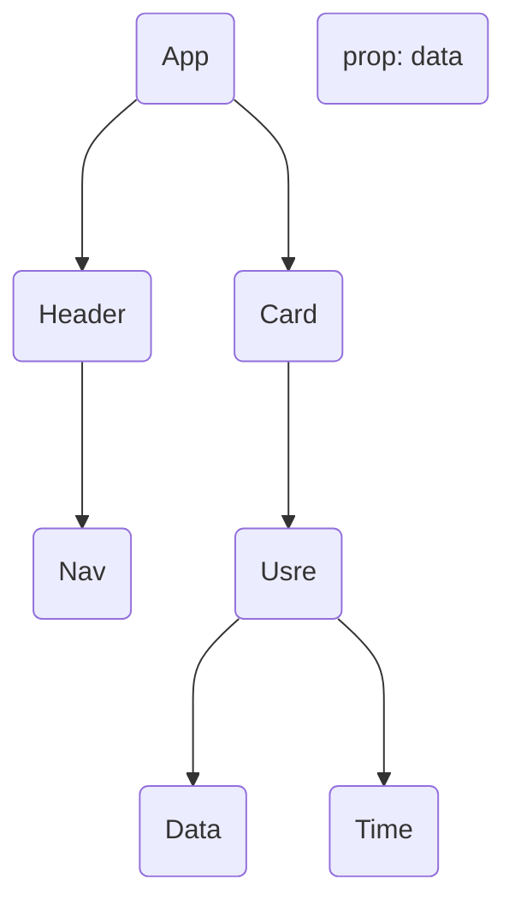

## Vue.js

- Vuejs is a JavaScript **FRAMEWORK** used for building user interfaces, particularly for single-page applications (SPAs). It is designed to be incrementally adaptable and can be easily integrated into other projects.

### Why Vue.js?

#### Ease of Learning

- VueJs is known for its simplicity and ease of learning, making it a great choice for beginners in web development.

#### Flexibility

- Vues is designed to be incrementally adaptable. You can use as much or as
  little of it as you need in your project.

#### Component-Based Architecture

- Vues promotes a component-based architecture, which is a widely adopted
  and efficient way to build user interfaces.

#### Reactivity

- Vues provides a reactive data-binding system, simplifying the process of
  keeping the Ul in sync with the application state.

#### Growing Ecosystem

- Vue.js has a growing ecosystem of libraries, tools, and plugins developed by the community.

#### Performance

Vues is designed with performance in mind. Its reactivity system and virtual
DOM help optimize rendering, making it suitable for building efficient and
fast applications.

#### Job Opportunities

As Vue js gains popularity, the demand for developers with Vue.js skills is
increasing. Learning Vue.js can enhance your job prospects, especially if
you're interested in working on modern web development projects.

#### Integration with Other Technologies

Vue js can be easily integrated with other libraries and frameworks. For
example, you can use Vue.js alongside Vuex for state management or Vue
Router for routing.

### What Is Component?

- A component is a reusable and self-contained unit that encapsulates a
  specific piece of functionality or user interface. Components are a
  fundamental building block of Vue applications, and they allow you to
  organize and structure your code in a modular way.

#### Why Components?

##### Modularity

- Components allow you to break down your application into smaller, reusable
  pieces. Each component is responsible for a specific feature or functionality,
  making it easier to understand and maintain your code.

##### Reusability

- Components can be reused across different parts of your application or even
  in multiple projects. This reusability reduces redundancy in your code and
  speeds up development.

##### Maintainability

- With components, it's easier to manage and maintain your codebase. Each
  component is a self-contained unit with its own functionality, making it
  simpler to troubleshoot and update.

### Text Interpolation {{}}

- Text interpolation in refers to the process of dynamically `binding data` to the content of an HTML element in your template. It allows you to display the value of a JavaScript expression or a variable within the markup.

```javascript
syntax;
{
  {
    data;
  }
}
```

#### Attribute Bindings :

Attribute binding is a way to bind HTML `attributes` to data in Vue instance.

- old Way

  - v-bind:attr

- new way
  - :attr

### Day1

- Intro
- What is Vue.js?
- Side Talk
- Installations
- Folder Structure
- Component In Depth
- Text Interpolation
- Attribute Bindings
- Dynamic Bindings
- Styling In Depth

---

#### Reactivity?

- Reactivity means that the framework can automatically update ( Ul) when the information behind it changes. It's a core concept that allows you to create `dynamic` and `Responsive` applications without manually manipulating the DOM.

### Way to achive Reactive State.

- reactive()
- ref()

#### reactive()

- The reactive function is used to create reactive objects. A
  reactive object is an object where changes to its properties
  are automatically detected, `(triggering updates)` in the user
  interface. It is a way to make an object "reactive" in Vue.js.

- Can't store primitive data types

#### ref()

- ref() is used to create a reactive reference to a value. Unlike
  the reactive function, which is used for creating reactive
  objects, ref is specifically designed for creating reactive `single values`

- You can store any value you want

### Computed Properties

- A computed property is a special kind of variable that `automatically updates` itseif whenever the data it depends on changes.

- It's like a little worker that watches certain data, performs some work on it, and always gives you the most up-to-date result.

### Conditional Rendering

- Conditional rendering is refers to the ability to
  conditionally display or hide elements in the user
  interface based on certain `conditions` OR `Expressions`

- v-if( `condition`)
- v-else-if( `condition`)
- v-else
- v-show

#### v-show

- v-show directive is used for conditional rendering. It toggles the visibility of an element based on the truthiness of the provided expression. Unlike v-if, which completely adds or removes the element from the DOM, v-show toggles the CSS display property of the element to control its visibility while keeping it in the DOM.

### List Rendering

#### v-for

- The v-for directive is used to `iterative over` an array or an object and render a template for each item in the collection.

##### Efficient DOM Updates

- When Vue renders a list of elements, it uses a virtual DOM to determine the most
  efficient way to update the actual DOM. The key helps Vue identify which elements
  have changed, been added, or been removed.

- Without keys, Vue may need to recreate the entire DOM structure for each update,
  which can be less efficient

##### Avoiding Common Pitfalls

- Using key can help avoid common pitfalls, such as duplicate key warnings in the
  console or incorrect rendering when items are rearranged in the list.

- Vue relies on keys to track the identity of elements, and using unique keys for each
  item ensures that Vue can accurately update the DOM based on changes in the list.

---

### Day2

- Event Handlers In Vue
- Reactivity & Reactive
- ref()
- Computed Properties
- Conditional Rendering
- v-for

### v-model

- v-model is a directive that provides two-way data binding on an input, textarea, or select element. It creates a `Connection` between the data in your component and the input field, allowing changes in one to automatically update the other and vice versa.

#### Two Way Binding?

- Two-way binding means that changes irt your code `automatically` update what you see on the screen, and vice versa. It's like a live
  connection between your data and the user interface, making it easy to keep them in sync without writing a lot of extra code.

### Props?

- "props" (short for properties) are a way to pass data from a parent component to child component. Props allow you to communicate between components by allowing the parent component to pass data down to its child components. This is useful for creating reusable and modular components.

- Props are immutable. we cannot change props value

### Component Event?

- Component events are a way for child components to
  communicate with their `parent components`. They allow
  child components to emit events (custom events) that can be listened to and handled by their parent components.

#### Child Component Emits an Event

- Inside a child component, you can use the $emit method to trigger a custom event. This event can carry data that you want to send to the parent.

#### Parent Component Listens to the Event

- In the parent component's template, you can use the v-on directive (or the shorthand @) to listen for the custom event emitted by the child.

### Day3

---

- v-model
- Props
- Component Event

### Slot

- A slot is like `space in a component` here you can put
  different things. It allow you to create reusable components that can accept different content while maintaining a consistent structure.

#### Fallback / Default Content

- Fallback content in slots refers to the default content that is displayed when no content is provided for a particular slot. It's a way to ensure that a component still has `meaningful content`, even if the parent component does not pass any content to a specific slot.

#### Named Slots

- A named slot is a way to assign a specific name to a slot in a component. Unlike the default slot, which is unnamed and used when no explicit name is provided, named slots allow you to have multiple slots in a component and specify where the content should be inserted based on the slot's name.

### `After this all the codes are available in ch02`

### Provide & Inject

- The provide and inject options are used for providing and injecting properties or `data down the component` hierarchy. They enable a form of dependency injection, allowing a parent component to provide data or methods that child components can then inject and use.



#### Provide

- Provide is an option in a parent component that allows it to share data or methods with its child components. It makes properties or methods available for injection into child components.

```vue
`App.vue`
<script setup>
const studentName = 'alex' const studentAge = 22 const studentLocation =
['Earth', 'IDK']
</script>
<template>
  <SchoolComponent
    :studentName="studentName"
    :studentAge="studentAge"
    :studentLocation="studentLocation"
  />
</template>

`School.vue`
<script setup>
import StudentComponent from "./StudentComponent.vue";
defineProps(["studentName", "studentAge", "studentLocation"]);
</script>

<template>
  <h1>Hello From school</h1>
  <StudentComponent
    :studentName="studentName"
    :studentAge="studentAge"
    :studentLocation="studentLocation"
  />

  `student.vue`;
  <script setup>
    defineProps(["studentName", "studentAge", "studentLocation"]);
  </script>

  <template>
    <h1>From Student {{ studentName }}</h1>
    <h1>From Student {{ studentAge }}</h1>
    <h1>From Student {{ studentLocation }}</h1>
  </template>
</template>
```

### Lifecycle Hooks

- `What is LifeCycle Methods/Hooks ?`
- Each Vue component instance goes through a series of initialization
  steps when it's created - for example, it needs to set up data
  observation, compile the template, mount the instance to the DOM,
  and update the DOM when data changes. Along the way, it also runs
  functions called lifecycle hooks, giving users the opportunity to add
  their own code at specific stages.

- Lifecycle hooks are special methods provided by Vue.js that allow you to execute code at different stages of a component's lifecycle. These hooks provide developers with the ability to perform actions or respond to events at specific points during the creation, updating, and destruction of a Vue component.

#### Lifecycle Hooks Methods

1. beforeCreate
1. created
1. beforeMount
1. mounted
1. beforeUpdate
1. updated
1. beforeUnmount
1. unmounted


#### Mount

- Mounting means when a component is being created and
  inserted into the DOM.

#### Unmount

- Unmounting means when a component is being removed
  from the DOM.

#### onBeforeMount()

- Registers a hook to be called right before the component is to
  be mounted.
  When this hook is called, the component has finished setting
  up its reactive state, but no DOM nodes have been created yet.
  It is about to execute its DOM render effect for the first time.

#### onMounted()

- onMounted is used for executing logic or actions after a
  component has been mounted to the DOM. This hook is
  particularly useful for tasks that should occur once the
  component is ready to interact with the user, such as fetching
  data, setting up event listeners, or performing initial
  calculations.

#### onBeforeUpdate()

- Registers a hook to be called right before the component is
  about to update its DOM tree due to a reactive state change.
  This hook can be used to access the DOM state before Vue
  updates the DOM. It is also safe to modify component state
  inside this hook.

#### onhUpdated()

- Registers a callback to be called after the component has
  updated its DOM tree due to a reactive state change.
  This hook is called after any DOM update of the component,
  which can be caused by different state changes, because
  multiple state changes can be batched into a single render
  cycle for performance reasons.

#### onBeforeUnmount()

- Registers a hook to be called right before a component
  instance is to be unmounted.
  When this hook is called, the component instance is still fully
  functional.

#### onUnmounted()

- Registers a callback to be called after the component has
  been unmounted.

- Use this hook to clean up manually created side effects such
  as timers, DOM event listeners or server connections.

### Watchers

- "watcher" allows us to reactively `watch for changes` in a specific property or expression and perform some custom logic when that property or expression changes. Watchers are part of Vue.js's reactivity system, which enables the framework to automatically update the DOM when the underlying data changes.

```vue
<script>
// watcher syntax
watch(source, callback, options);

// The “callback” function is called whenever some data changes.
watch( source, (newVal, oldVal) = { })
</script>
```

### Template Ref

- A template ref is a way to create reference to a child component, element, or a DOM element within a template. This allows you to access and manipulate the referenced object directly in your component's logic. Refs are commonly used to interact with child components, trigger imperative actions, or access properties and methods of DOM elements.

### Day 4

---

- Slots
- Provide & Inject
- Lifecycle Hooks
- Watchers
- Template Ref

### Async Component

- Async component is a feature that allows you to load a component
  asynchronously, meaning the component is loaded and rendered
  only `when it's needed`. This is particularly useful for optimizing the
  initial loading time of your application, especially when dealing with
  large and complex components that might not be necessary on the
  first page load.

#### defineAsyncComponent() |

- Is used to create asynchronous components. Async components |
  are loaded and resolved asynchronously, which can be helpful for |
  improving the initial loading performance of your application by |
  deferring the loading of certain components until they are actually |
  needed. |

```javascript
defineAsyncComponent(() => {
  import("./ComponentPath.vue");
});
```

### Composable |

- A composable is a function or set of functions that encapsulate |
  a piece of logic and can be composed together to build the |
  functionality of a Vue component. Composables are designed |
  to be reusable and shareable, making it easier to manage |
  complex logic and behavior in a Vue application. |

### Custom Directives |

- Vue provides a set of built-in directives such as |
  v-if, v-for, v-model, etc. Custom directives allow |
  you to define your own behavior that can be |
  applied to elements in the template. |

#### How to create one? |

- A custom directive is defined as an object |
  containing lifecycle hooks similar to component |
  hooks eg. mounted() unmounted etc. |

```javascript
// syntax
const vFormatDiv = {
  mountef: (el, binding) => {
    (el.style.fontsize = "4rem"), (el.style.fontStyle = "italic");
  },
};
```

### Dynamic Components |

- Dynamic components refer to the ability to dynamically |
  switch between different components based on certain |
  (conditions or user interactions. This is achieved using the |
  component element and the is attribute. |

### Day 5

---

- Async Components
- Composables
- Custom Directives
- Dynamic Components
- Data Fetching In Vue

### Next Projects
